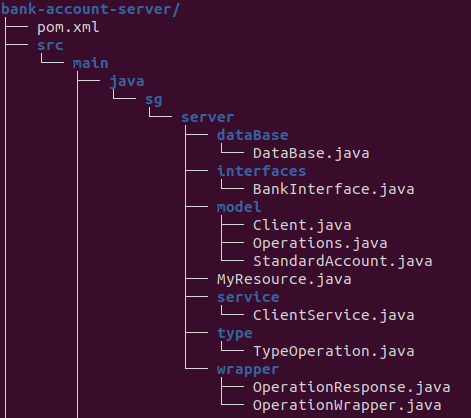
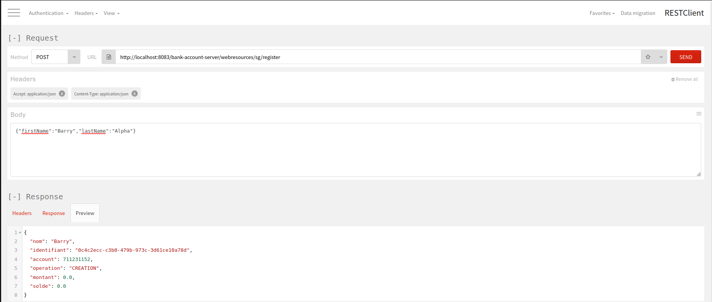
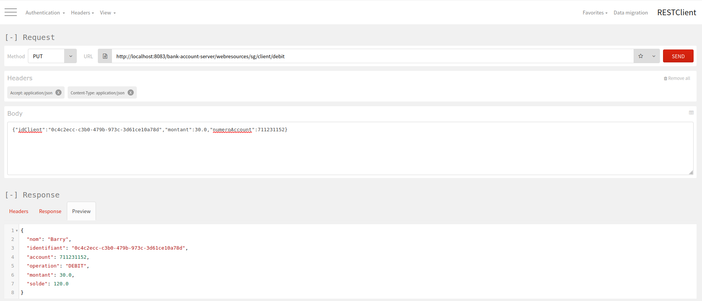
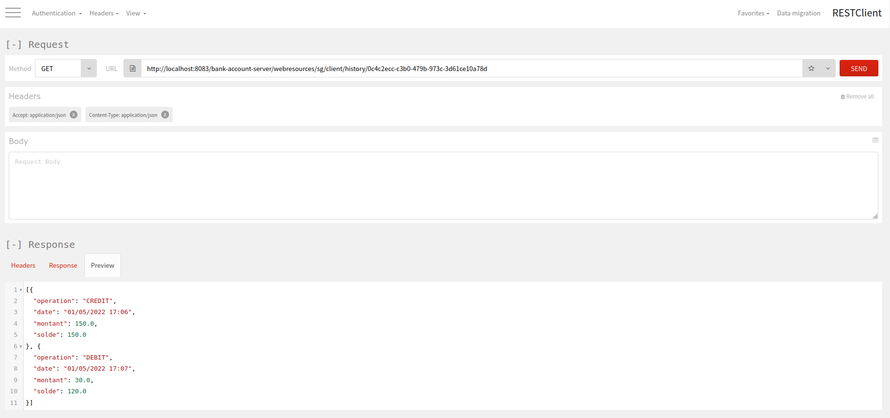

# BARRY Mamadou alpha
### Bank account Société Générale

*** 
Problématique
***
En tant que client de la Société Générale, je voudrais faire un dépôt et un retrait sur mon compte. Ensuite je voudrais pouvoir
obtenir l'historique de mes opérations sur mon compte.

A fin de répondre à cette problématique de maniére simple, j'ai choisi d'implementer une application web service avec java.
La structure du projet est composé comme suit:

  
- Package dataBase: dans ce package j'ai implementé un singleton qui represente une base de données afin de me permetre de manipuler les données.
- Package interfaces: dans ce package on retrouve les interfaces dont une interface qui represente une banque
- Package service: les services sont implemntés dans ce package. C'est sont les service qui font office de code métier c'est à dire 
toutes les operations à réaliser.
- Package type: Ici on retrouve une énumeration qui represente les type d'operations dont CREDIT, DEBIT ou CREATION
- Package wrapper: afin d'englober les objets réçus ou envoyés à partir des requêtes, j'ai mis en places des classes comme type de retour ou d'envoie.
- Package model: Les model de données par exemple le client, ou une operation y sont implementés.
***
Lancement du projet
***
Pour executer le projet: Cloner le projet et importer le dans Eclipse, ensuite charger le projet dans un server Tomcat v8.5 de preference.
Assurez-vous que le port 8080 n'est pas utilisé. 
Ensuite, utiliser Postman ou un outil qui vous permet d'envoyer des requêtes POST ou PUT. Mettez en place les Headers suivant:
- Accept: application/json
- Content-Type: application/json
###### les liens
> POST http://localhost:8083/bank-account-server/webresources/sg/register
- exemple du body : {"firstName":"Barry","lastName":"Alpha"}
> PUT http://localhost:8083/bank-account-server/webresources/sg/client/credit
- exemple du body : {"idClient":"8d1559a4-249f-4d6c-b804-b2799c668526","montant":150.0,"numeroAccount":1657946658}
> PUT http://localhost:8083/bank-account-server/webresources/sg/client/debit 
- exemple du body : {"idClient":"8d1559a4-249f-4d6c-b804-b2799c668526","montant":30.0,"numeroAccount":1657946658}
> GET http://localhost:8083/bank-account-server/webresources/sg/client/history/8d1559a4-249f-4d6c-b804-b2799c668526
***
Fonctionnement
***
Pour refléter au plus près la réalité, j'ai commencer par mettre en place un service de création d'un client avec un nom et prénom. 
Une fois le client crée, un numero unique (identifiant) lui est affecté mais également un compte bancaire standard ayant un numero et un solde à 0.0
- Register

Une fois que le client est crée, il reçois son identifiant et le numero de son compte. Avec ces identifiants, le client peut faire les operations :
- Debit
  
- Credit
  
- Historique des operations
  
